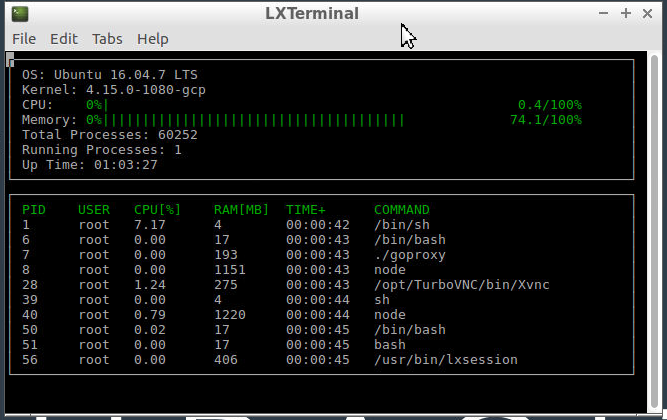

# ND-Cpp-System-Monitor
### *A terminal based system monitor using ncurses library*

***

<ins>**Description**</ins>

A **C++17** project which displays system information such as OS, kernel,
memory utilization, processes, etc. in a terminal. This project is my submission 
for the [Udacity Project](https://github.com/udacity/CppND-System-Monitor) which 
requires writing C++ code to parse files and directories in Linux `proc`
and `etc` directory and display data on a terminal, similar to the widely used 
[htop](https://htop.dev/) application.  

This project uses the [ncurses](https://invisible-island.net/ncurses/announce.html) library, which facilitates text-based graphical output in the terminal.

This project runs **ONLY** in Linux environment, when compiled with `-std=c++17` command-line flag, since it uses `std::filesystem`. On Windows Subsystem for Linux, it gives a segmentation fault.

***

<ins>**Cloning**</ins>

Clone this project to a local destination using git:
`git clone https://github.com/CybernetHacker14/ND-Cpp-System-Monitor.git`

***

<ins>**Pre-requisites**</ins>

The following libraries need to be installed.

1. CMake
2. ncurses

Install `ncurses` within your own Linux environment by running:  
`sudo apt install libncurses5-dev libncursesw5-dev`

You can also use **Visual Studio Code** as an IDE.

***

<ins>**Instructions**</ins>

1. Open a terminal window in the project directory, and build the project 
using : `make build`
2. Run the resulting executable: `./build/monitor`

***

<ins>**Screenshot**</ins>

